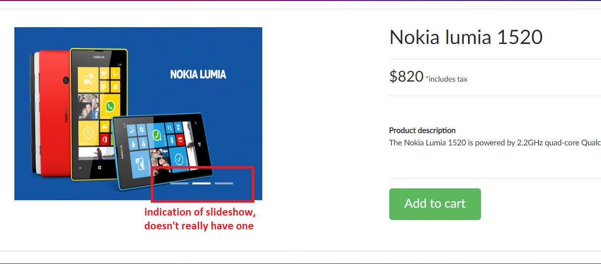
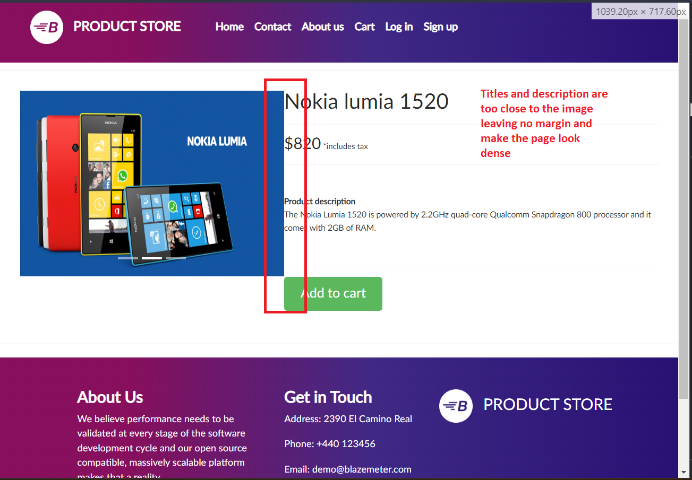
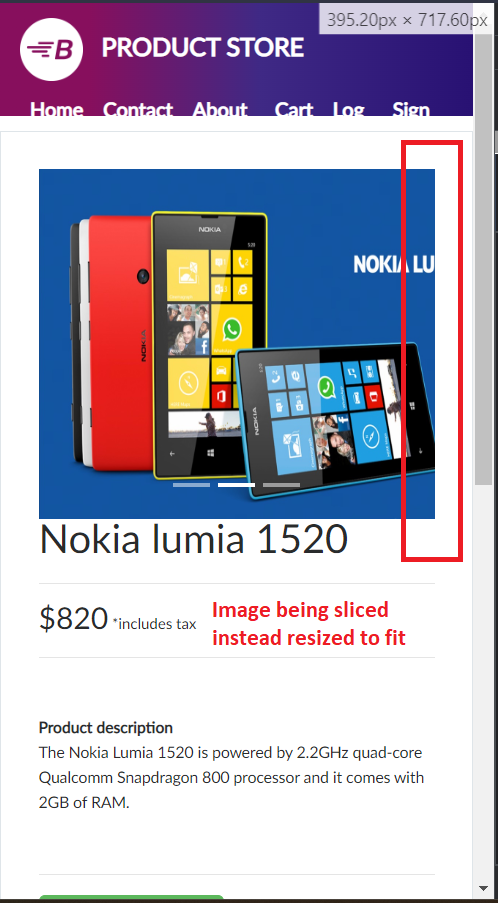

# Selenium Project Team 3
Creators: Alon, Eliav, Artium, Nir \
Date: 12/3/2023 \ 

## [Demoblaze](https://demoblaze.com/)
<https://demoblaze.com> is a demo website for electronics e-commerce store \
The site sells Phones, Laptops and Monitors

In this project we had to make tests on this site. \
Meaning we had to assess how valid is the website to operate successfully? 

The short answer is: NO \
The long answer has to dig in the suggestive requirements:
* Homepage - The main page
* Contact - A modal
* About Us - A modal
* Cart - A site contains the cart info
* Log In - A modal which allows users to log in
* Sign Up - A modal which creates users

You are welcomed to dig in our project and look for the tests and bugs 
* Pages folder contains functions relevant for certain pages 
* Tests folder contains the test suites and test cases for each requirement 
* utils.py is a file which takes in the imports 
* locators.py is a file which indexes elements in the webpage

## Errors we found
<ol>
    <li>UI issues:
    <ol>
        <li>
        Product Page:  
        

              
              
            
        

        </li>      
    </ol>
    </li>
</ol>