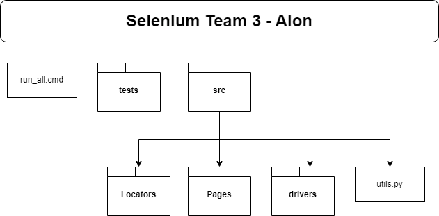

# Selenium Project Team 3
Creators: Alon, Eliav, Artium, Nir \
Date: 12/3/2023 \
Appendencies: [Traceability Table in Google Sheets](https://docs.google.com/spreadsheets/d/1VvUd2FPTsDQSyj9s7KK2liYoMto5XbzG_3cb7UyAajo/edit?usp=sharing)

### Background:
We are 4 QA students in a college called "IITC College" in Ramat Gan, Israel. <br>
As part of our studying we received a project to test [demoblaze.com](https://demoblaze.com) - find bugs, asking questions, test where the site could fail. <br>
We were required to use Selenium package in order to automate the tests. \
After one week of work around this project we finally finished with the project.

### Workflow:
Before we started building tests we had to explore the site, as no one was familiar with site before. <br>
We started with exploratory tests, trying to figure out the content and purpose of the site. <br>
Afterwards we started to think about the structure of the project files. \
We decided to go with POM (Page Object Model) model and start build the structure. \

First thing we wanted was to import our needed packages and an easy way to pull those at once. We created a file called "utils.py" which includes the package imports we need for most of the project.
```
first few lines of utils.py: 

import selenium
import requests

from selenium import webdriver as WebDriver
from selenium.webdriver.common.by import By
from selenium.webdriver.common.keys import Keys
```
We needed a "tests" package to include the automatic test cases. \
We also wanted a "pages" package to include functions within pages, thus, for example, we can log in easily from everywhere we need to. \
After a little more time we realized we can optimize the work when using "locators". the locators file include a class called "Locator" and dictionaries of web elements we gathered to easily access them.
```
first few lines of locators.py:

class Locator:
    locHome = dict()

    # Header
    locHome['Head_Home'] = (u.By.XPATH, '//a[text()="Home "]')
    locHome['Head_Contact'] = (u.By.XPATH, '//a[text()="Contact"]')
    locHome['Head_About_Us'] = (u.By.XPATH, '//a[text()="About us"]')
    locHome['Head_Cart'] = (u.By.XPATH, '//a[text()="Cart"]')
```

We also had writing conventions. To further read open the ["README2.md"](https://github.com/VSciFlight/selenium_team_3/blob/main/README2.md)\

## [What is Demoblaze](https://demoblaze.com/)
<https://demoblaze.com> is a demo website for electronics e-commerce store \
The site sells Phones, Laptops and Monitors


In this project we had to make tests on this site. \
Meaning we had to assess how valid is the website to operate successfully 

The short answer is: NO \
The long answer has to dig in the suggestive requirements:
* Homepage - The main page
* Contact - A modal
* About Us - A modal
* Cart - A site contains the cart info
* Log In - A modal which allows users to log in
* Sign Up - A modal which creates users

## Instructions
You are welcomed to dig in our project and look for the tests and bugs 
* Pages folder contains functions relevant for certain pages 
* Tests folder contains the test suites and test cases for each requirement 
* utils.py is a file which takes in the imports 
* locators.py is a file which indexes elements in the webpage
* run_all.cmd runs all the tests in a sequence, non-stop

<h3>Requirements</h3>
Python Version: 3.10 <br>
IDE: PyCharm Community Edition 2022.3 <br>
Browsers: Google Chrome <br>
Operating System: Windows 10, Windows 11 <br>

in order to run the tests locally you have to download (get git) the git and create new virtual environment. <br>

#### Python Packages:
<ul>
    <li>Selenium</li>
    <li>unittest</li>
</ul>

**in order to run all tests you have to run the "run_all.cmd"**
### [Sum of errors we discovered can be found here](https://docs.google.com/spreadsheets/d/1VvUd2FPTsDQSyj9s7KK2liYoMto5XbzG_3cb7UyAajo/edit?usp=sharing)

